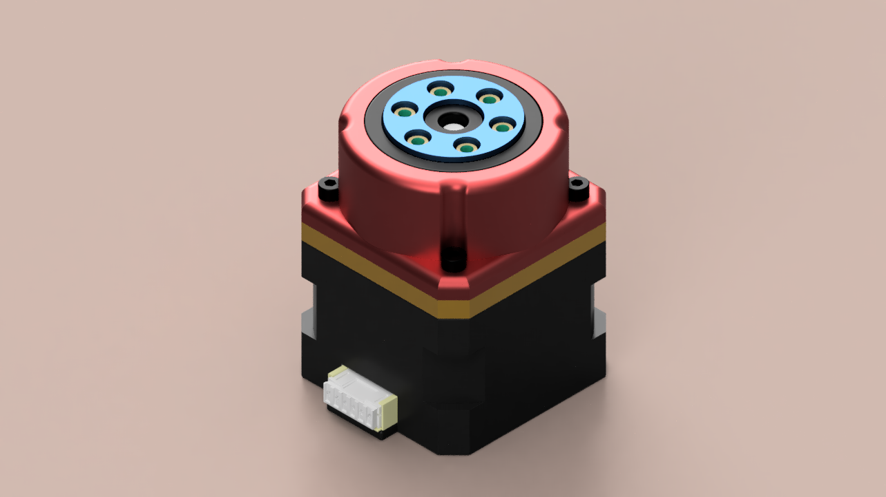
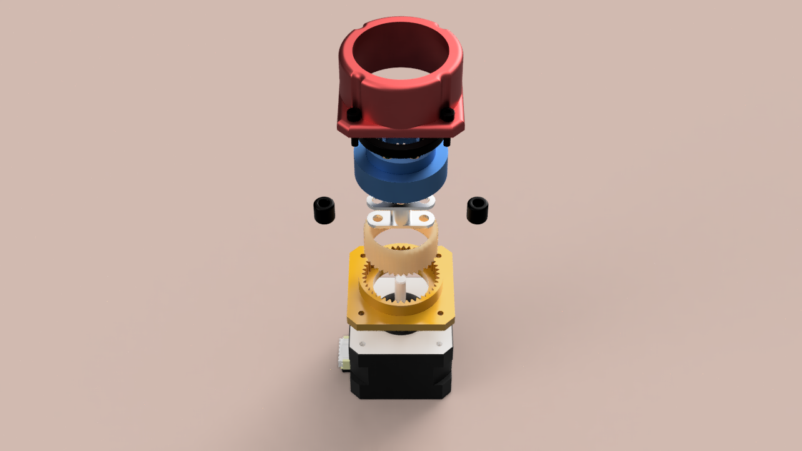
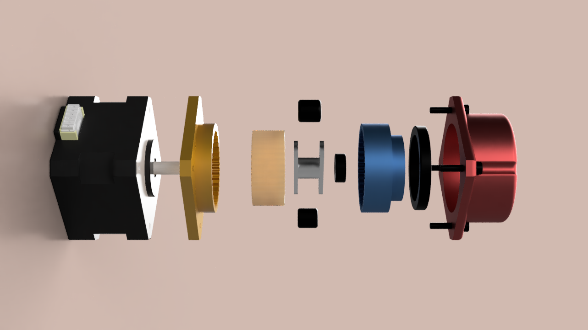
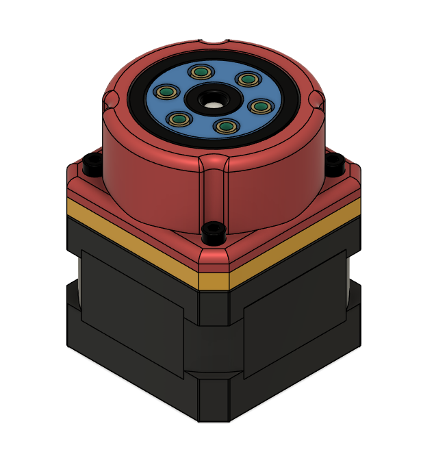
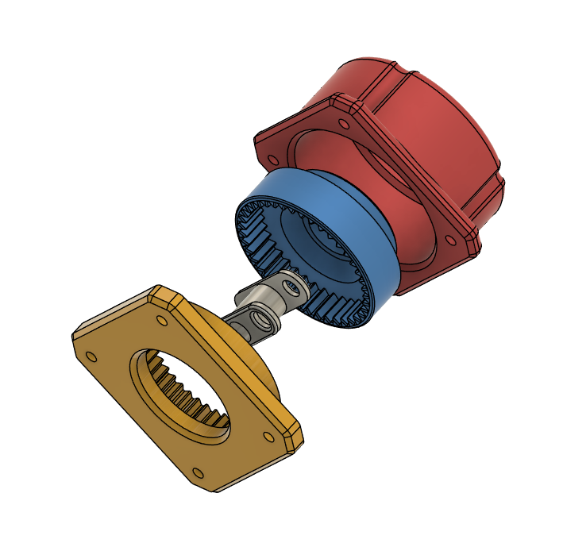

# Harmonic Drive - AR-HARDR-R3  

A **3D-printed 20:1 harmonic drive** designed for use with **NEMA 17 stepper motors**.  
This project demonstrates the design, assembly, and testing of a compact, high-reduction drive system created in **Fusion 360** and optimized for 3D printing.  

---

## ⚙️ Features  

- ✅ **Gear ratio:** 20:1  
- ✅ **Motor compatibility:** NEMA 17 stepper motors  
- ✅ **3D printed components**  
- ✅ Compact and lightweight design  
- ✅ Entirely modeled in **Fusion 360**

---

## 📂 Repository Contents 

- `/3D` →  CAD models, STEP files
- `/assembly` → Physically assembled version
- `/documents` → Technical drawing
- `/images` → Renders and exploded views
- `/test` → Test result

---

## 🖼️ Project Gallery 

### Rendered Views  
  
  
  

### 3D CAD Views  
  
  

### Assembled gearbox with custom driver board featuring TMC2209 Drivers, an ESP32 development board, and custom firmware

---

## 📐 Components / Bill of Materials (BOM)  

The harmonic drive consists of the following major parts:  

- **NEMA 17 stepper motor** (42 × 42 × 30 mm)  
- **Circular spline** – rigid outer gear with internal teeth  
- **Flex spline** – thin, deformable cup with external teeth  
- **Output gear** – connects the flex spline to the driven load  
- **Wave generator (rotor)** – elliptical driver that deforms the flex spline  
- **Bearings** – provide smooth rotation and reduce friction  
- **Heat inserts** – allow threaded fastener connections in 3D printed parts  
- **Enclosure / housing** – holds all components in alignment  

---

## 🛠️ Assembly  

1. Print the components from the `3D/` folder.  
2. Press-fit **bearings** into the enclosure.  
3. Mount the **rotor (wave generator)** to the stepper motor shaft.  
4. Fit the **flex spline** onto the wave generator.  
5. Insert the flex spline into the **circular spline**.  
6. Attach the **output gear**.  
7. Insert **heat inserts** and secure with screws.    

---

## 📊 Testing  

The drive has been tested for:  
- Smooth and consistent rotation  
- Low backlash  
- Durability of 3D printed components under load  

Results and notes are available in the `test/` directory.  

---

## 🔧 Applications  

- Robotics (robotic arms, grippers, joints)  
- CNC machines  
- Automation systems  
- Educational and prototyping projects

---

## 🎯 Purpose
This is a **personal build project** intended as a DIY hardware showcase.  
The schematic and PCB layout are provided **for reference and inspiration only**.  

---
